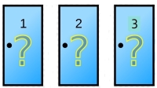

# A Monty Hall Simulator

## Demo

### Default Game:

### Custom Game & Saving:

## Inspiration

In my STAT 302: Introduction to Probability course, we talked about the Monty Hall game show
situation. To read more about the setup of the game, you can visit:
https://statisticsbyjim.com/fun/monty-hall-problem/. Very briefly, the game runs as follows:

There are three doors to pick from. Two of them have a goat behind it, and one of them has
a brand-new car behind it. The door you pick corresponds to the item you are bringing home.

#### Example Gameshow Snippet:

Monty Hall (the game show host) tells you "Pick a door!".

I am a contestant, and I pick door 1. Monty Hall, upon hearing this, opens door 3 and 
reveals that there is a goat behind that door.

Now, he asks "would you like to switch to door 3? Or 
would you like to stick with door 1?" This is where the contestants make their final decision.

## Goal
During my STAT 302 class, we analyzed the mathematics behind this game, showing the counterintuitive result 
that **switching doors actually leads to a doubled chance of winning the car compared to not 
switching**. I thought that it would be helpful to build a simulation to compare the options 
of switching and not switching over thousands of simulated games, and count the probabilities. 

My application is a dashboard where you can extensively learn the Monty Hall 
problem interactively. It will include:

- The default game that is the classic Monty Hall problem
- Customizable game scenarios that can be built through adding doors of your choice
- Clickable doors to check the prize behind certain doors
- Functionality to run a simulation of your custom-built game scenario 1000 times and comparing the performance of "switching" 
  vs "not switching".
  
This project was inspired by the avid mathematics tutor/teacher in me. Through this application, I want 
to extend my help to students who may struggle with math in one way or another with this concept.

[comment]: <> (## Phase 4: Task 3)

[comment]: <> (There are three main things I would refactor if I had the time.)

[comment]: <> (1. I actually stumbled upon this solution half way through Phase 2, but just did not find the time to refactor)

[comment]: <> (it properly. This problem lies in the relationship between **RunGameShow** and the Goat, Car, and Door classes,)

[comment]: <> (   *even though* it already contains a GameShow that is associated with those classes. In the UML diagram,)

[comment]: <> (   this is captured by the protruding lines from the UI section to the model section. I actually solved this problem in )

[comment]: <> (   GameShow already with the method setupStandardGameShow&#40;&#41;, but I just never removed the associations in )

[comment]: <> (   RunGameShow.)
   

[comment]: <> (2. I recognized during Phase 3 that the GUI classes GraphPanel and DoorPanel are observers of the ButtonPanel class.)

[comment]: <> (   If I had time, I would have implemented the Observer Pattern on them to reduce some redundancies. GraphPanel and )

[comment]: <> (   DoorPanel would implement the Observer interface, the ButtonsPanel would implement the Observable interface. Then,)

[comment]: <> (   notifyObservers&#40;&#41; would be called in the actionPerformed&#40;&#41; method in ButtonsPanel and update would be specific for )

[comment]: <> (   GraphPanel and DoorPanel.)
   

[comment]: <> (3. Lastly, I would want to eliminate the need for a JsonReader & JsonWriter in the Simulations class. Once again, there)

[comment]: <> (seems to be unnecessary coupling as GameShow already contains both of those classes, and it forms a triangle between )

[comment]: <> (   GameShow, Simulation, and the data persistence classes.)